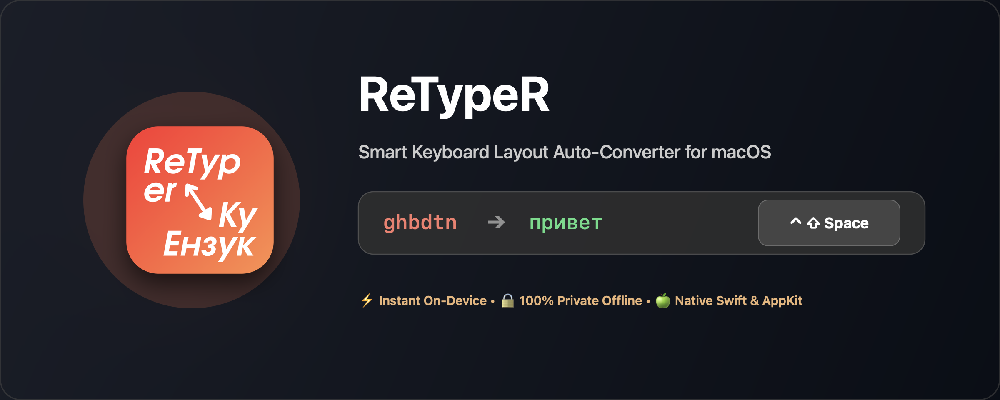
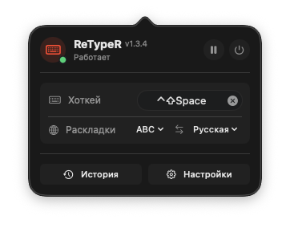
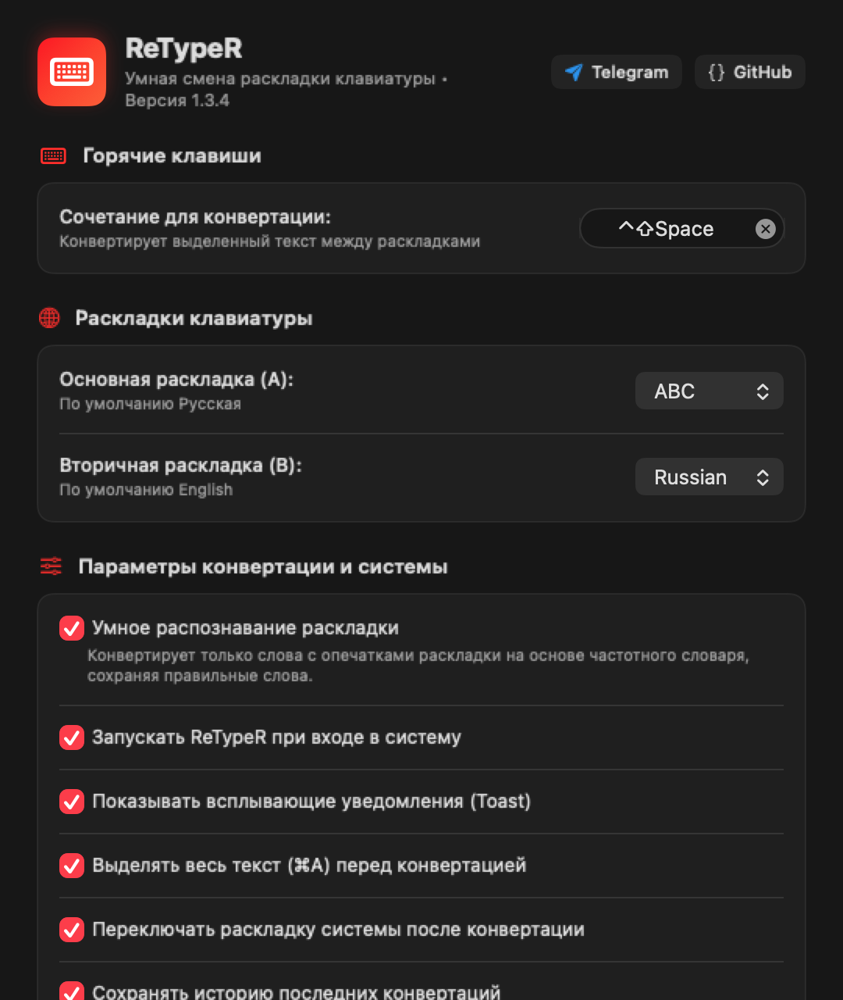
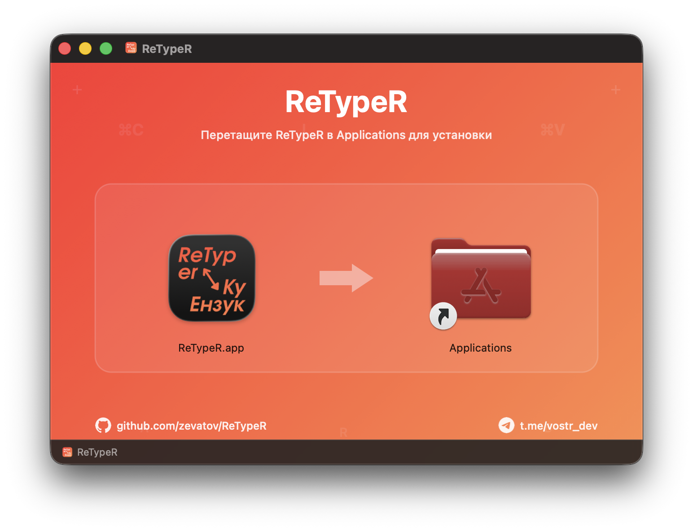

<div align="center">

# ⌨️ ReTypeR

**Нативная утилита для macOS, которая исправляет текст, набранный в неправильной раскладке клавиатуры**

[-black?style=for-the-badge&logo=apple&logoColor=white)](https://apple.com/macos)
[](https://swift.org)
[](Tests/)
[](LICENSE)
[](https://github.com/zevatov/ReTypeR/releases)

<br/>



<br/>

[ Скачать ReTypeR.dmg ](https://github.com/zevatov/ReTypeR/releases/latest) • [ Возможности ](#-возможности-v135) • [ Настройки ](docs/SETTINGS_GUIDE.md) • [ Дорожная карта ](#-дорожная-карта-и-экосистема) • [ Сборка ](#-сборка-из-исходников)

</div>

---

**ReTypeR** — утилита для macOS, которая исправляет текст, набранный в неправильной раскладке клавиатуры: `ghbdtn` → `привет`, `руддщ` → `hello`. Работает с любой парой раскладок через умный анализ текста (v1.3). Конвертация выполняется полностью локально, без сети; единственная сетевая операция — проверка обновлений при открытии настроек (см. [«Обновления»](#обновления)).

> Историческая справка: продуктовый OCR-режим (распознавание текста с выделенной области экрана) **удалён из прод-кода 2026-09-14**. Исторические упоминания OCR — [`CHANGELOG.md`](CHANGELOG.md) (блок [1.3.0]), [`docs/ARCHITECTURE_V13.md`](docs/ARCHITECTURE_V13.md), [`docs/HANDOFF.md`](docs/HANDOFF.md).

---

## 📸 Интерфейс приложения

<div align="center">
  <table border="0">
    <tr>
      <td align="center" width="40%" valign="top">
        <b>Строка меню (Компактный статус)</b><br/><br/>
        
      </td>
      <td align="center" width="60%" valign="top">
        <b>Окно настроек (Параметры и раскладки)</b><br/><br/>
        
      </td>
    </tr>
  </table>
</div>

Подробное руководство по каждому параметру доступно в документе:  
👉 **[Руководство по настройкам ReTypeR](docs/SETTINGS_GUIDE.md)**

---

## Возможности v1.3.5

### Умная конвертация раскладок (классы A–H)

- **Трёхуровневая валидация слов**: белые списки → частотные словари → орфографический словарь macOS (только для слов длиной $\ge 4$ — короткие аббревиатуры `kb`, `gb`, `bp` не считаются доказательством языка).
- **Расширенный частотный слой**: более 57 800 русских и 46 700 английских слов (OpenSubtitles 2018 + современные инфлексии, IT-терминология `git`, `npm`, `cli`, `sdk`, `деплой`, разговорная лексика); частотные словари встроены в приложение и дают надежное свидетельство при выборе направления конвертации.
- **Char-bigram модель**: компактные профили биграмм букв (33×33 RU / 26×26 EN, ~2 КБ) разрешают несловарные случаи (например, `[bhjcvc` → `хиросмс`).
- **Полная регистронезависимость (CAPS) и Shift-пунктуация**:
  - `GHBDTN` → `ПРИВЕТ`, `PFGECNB KJRFK[JCN` → `ЗАПУСТИ ЛОКАЛХОСТ`.
  - Поддержка символов `<`, `>`, `{`, `}` как соответствий русским буквам `Б`, `Ю`, `Х`, `Ъ`: фразы вроде `<jkmit >yjvf {jxe` корректно конвертируются в `Больше гнома хочу`, `<kby` → `Блин`, `Ghbdtn!` → `Привет!`.
- **Внутренняя пунктуация раскладки**: токены со знаками препинания внутри слов преобразуются корректно (например, `.pf.` → `юзаю`).
- **Фонотактический фильтр невозможных кластеров**: сочетания вроде `вьп` отсеиваются в пользу английских расширений и терминов (`вьп afqk` → `dmg файл`).
- **Разрешение коллизий коротких слов**: `tot` → `еще`, `bp` → `из`, `pf` → `за`, `lf` → `да`, `ye` → `ну` с контекстным голосованием для сохранения английских фраз (`a tot was playing`, `a cup of tea`).
- **Слипшиеся слова**: разделение двух известных слов, когда разрез однозначен.
- **Гистерезис направления и безопасный дефолт**: исключает осцилляции, не трогает URL, e-mail, пути и код (включая API-токены `sk-`, `ghp_`, `Bearer`).
- **Стабильный статус-бар на всех мониторах**: нативное отображение SF Symbol в темной и светлой теме, корректное позиционирование без перекрытия системными часами macOS Sequoia.

---

## Хоткеи

| Комбинация | Действие |
|---|---|
| `⌃⇧Space` | Конвертировать выделенный текст |

*(Настраиваются в меню: иконка в строке меню → Настройки)*

---

## Требования

- macOS 15.0+ (Sequoia)
- Разрешение **Accessibility** (Универсальный доступ — для чтения выделенного текста и эмуляции клавиш)

---

## Установка

<div align="center">
  
</div>

1. Скачайте **[`ReTypeR.dmg`](https://github.com/zevatov/ReTypeR/releases/latest)** из раздела [Releases](https://github.com/zevatov/ReTypeR/releases).
2. Перетащите **ReTypeR** в папку **Applications**.
3. Запустите приложение из **Applications**. При первом запуске:
   - Предоставьте разрешение **Accessibility** в окне онбординга — оно необходимо для работы хоткея.
   - Приложение подписано сертификатом Apple Development (Team ID `3ZMM724J2P`, Hardened Runtime) и **не нотаризовано** — Gatekeeper может потребовать ПКМ → «Открыть» при первом запуске; выданные разрешения сохраняются между обновлениями благодаря стабильному Team ID.

---

## Обновления

Проверка обновлений минималистична и не мешает работе:
- **Один запрос при открытии окна настроек**: выполняется единственный запрос `GET https://api.github.com/repos/zevatov/ReTypeR/releases/latest` — не периодически и не в фоне.
- **Индикатор без навязчивости**: если доступна более новая версия, в настройках появляется бейдж «Доступна X» со ссылкой на страницу релиза. Скачивание и автоустановка не выполняются.
- **Тихий фолбэк**: если релиза нет, ответ отличается от 200 (приватный репозиторий) или сеть недоступна, приложение молча считает версию актуальной; клик по индикатору без ссылки ведёт в канал разработки [`t.me/vostr_dev`](https://t.me/vostr_dev).
- **Телеметрия и фоновый сбор данных отсутствуют**; конвертация всегда выполняется локально.

---

## 🗺️ Дорожная карта и Экосистема

### Экосистема нативных утилит для macOS
ReTypeR развивается как часть серии локальных, быстрых и бесплатных инструментов в нативном стиле Apple от [Stanislav Zevatov](https://github.com/zevatov):
- 🎙️ **[SingAR](https://github.com/zevatov/SingAR)** — нативный голосовой ввод, ассистент диктовки и vibe-кодинга для macOS (локальный Whisper + Metal, буфер обмена).
- ⌨️ **[ReTypeR](https://github.com/zevatov/ReTypeR)** — мгновенная умная автоконвертация раскладки клавиатуры без сети и задержек.

### Ближайшие планы ReTypeR
- [ ] **Обновление меню настроек:** редизайн и поднастройка интерфейса параметров под актуальный дизайн macOS Sequoia, повышение наглядности и удобства управления.

---

## Приватность

ReTypeR обрабатывает все данные локально: ничего не отправляется на сторонние серверы.

При этом приложение поддерживает локальные журналы в `~/Library/Application Support/ReTypeR/`:
- `conversion_log.jsonl` — журнал конвертаций;
- история последних 50 конвертаций — доступна в интерфейсе приложения.

**Отключение истории**: тумблер **«Сохранять историю конвертаций»** в настройках ReTypeR. Ведение журнала выключено по умолчанию; в настройках также доступна кнопка полной очистки.

Полная модель угроз и границы доверия — [`SECURITY.md`](SECURITY.md).

---

## Сборка из исходников

Проект использует [XcodeGen](https://github.com/yonaskolb/XcodeGen):

```bash
xcodegen generate          # генерация ReTypeR.xcodeproj из project.yml
xcodebuild build -project ReTypeR.xcodeproj -scheme ReTypeR -configuration Release
```

Сборка готового брендированного DMG-образа:

```bash
scripts/build_dmg.sh       # → ReTypeR.dmg в корне проекта
```

Запуск тестов:

```bash
xcodebuild test -project ReTypeR.xcodeproj -scheme ReTypeR -destination 'platform=macOS'
```

---

## Данные частотности

Файлы `frequency_ru.txt`, `frequency_en.txt`, `bigram_ru.bin`, `bigram_en.bin` производны от проекта [FrequencyWords](https://github.com/hermitdave/FrequencyWords) (корпус OpenSubtitles 2018) и распространяются по лицензии **CC-BY-SA-4.0**.
Подробности и регенерация: [`FREQUENCY_DATA_LICENSE.md`](Sources/Resources/FREQUENCY_DATA_LICENSE.md), [`generate_frequency_resources.py`](scripts/generate_frequency_resources.py).

---

## Лицензия & Авторство

- Код ReTypeR распространяется под лицензией **MIT** — см. [`LICENSE`](LICENSE).
- Данные частотности распространяются по лицензии **CC-BY-SA-4.0** — см. [`FREQUENCY_DATA_LICENSE.md`](Sources/Resources/FREQUENCY_DATA_LICENSE.md) и [`NOTICE.md`](NOTICE.md).
- Автор: [Stanislav Zevatov](https://github.com/zevatov)
- Канал разработки: [t.me/vostr_dev](https://t.me/vostr_dev)
